# Fumen

[](LICENSE)
[](https://www.python.org/downloads/)
[](https://github.com/dondergg/fumen/actions/workflows/test.yml)

Render fumen PNGs from `.tja` charts.

```bash
pip install git+https://github.com/dondergg/fumen.git
fumen render chart.tja -o chart.png
```

## Links

- [CONTRIBUTING.md](CONTRIBUTING.md) — setup, CLI, API, TJA support
- [CHANGELOG.md](CHANGELOG.md)
- [LICENSE](LICENSE) — GPLv3

## Examples

| | |
|:---:|:---:|
| `barline_off.tja` | `bpm_170.tja` |
| 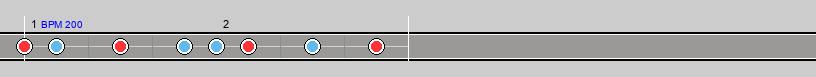 | 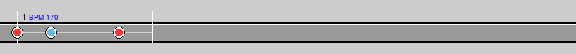 |
| `bpm_200.tja` | `bpm_row.tja` |
| 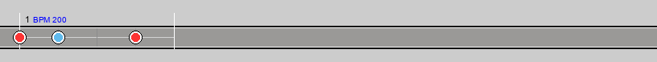 | 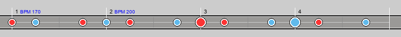 |
| `branch.tja` | `cross_measure.tja` |
| 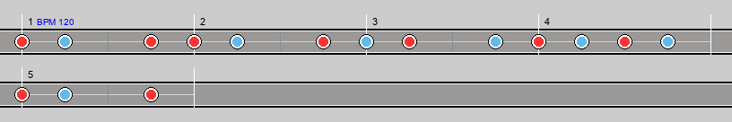 | 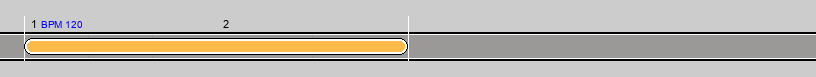 |
| `cross_row_roll.tja` | `dense_patterns.tja` |
| 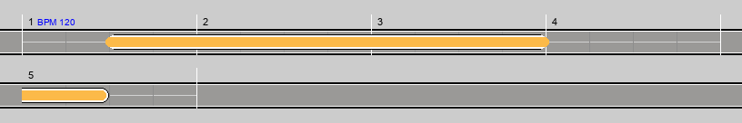 | 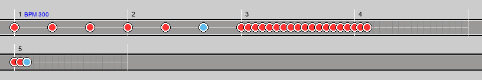 |
| `multi_course.tja` (course 0) | `multi_course.tja` (course 3) |
|  | 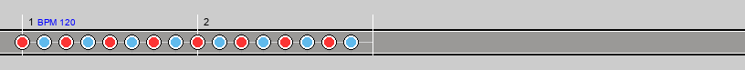 |
| `partial_gogo.tja` | `showcase.tja` |
| 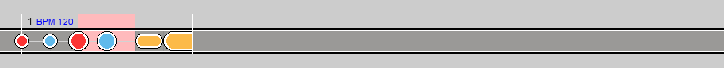 | 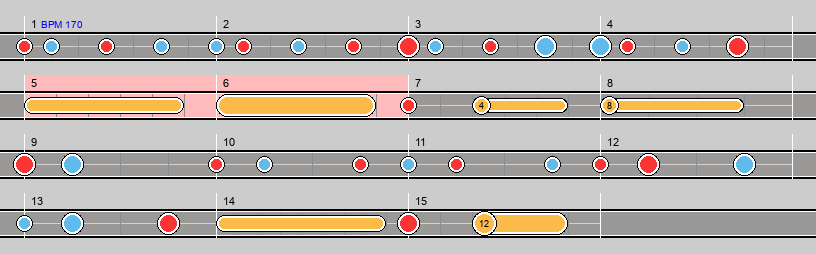 |
| `simple.tja` | |
| 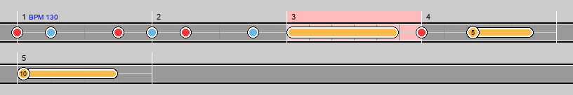 | |
